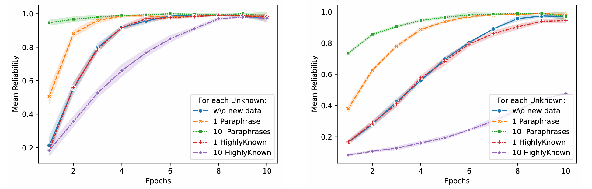

# How Much Knowledge Can You Pack into a LoRA Adapter without Harming LLM?


<p align="center">
  
  <em>Dynamics of the reliability score during training on 500 (left) and 3,000 (right) Unknown items along with paraphrases and HighlyKnown facts. Error bar is min-max for 3 seed run.</em>
</p>

[This paper on Arxiv](https://arxiv.org/abs/2502.14502)

[This paper on HuggingFace](https://huggingface.co/papers/2502.14502)

### Description

The performance of Large Language Models~(LLMs) on many tasks is greatly limited by the knowledge learned during pre-training and stored in the model's parameters. Low-rank adaptation (LoRA) is a popular and efficient training technique for updating or domain-specific adaptation of LLMs. In this study, we investigate how new facts can be incorporated into the LLM using LoRA without compromising the previously learned knowledge. We fine-tuned Llama-3.1-8B-instruct using LoRA with varying amounts of new knowledge. Our experiments have shown that the best results are obtained when the training data contains a mixture of known and new facts. However, this approach is still potentially harmful because the model's performance on external question-answering benchmarks declines after such fine-tuning. When the training data is biased towards certain entities, the model tends to regress to few overrepresented answers. In addition, we found that the model becomes more confident and refuses to provide an answer in only few cases. These findings highlight the potential pitfalls of LoRA-based LLM updates and underscore the importance of training data composition and tuning parameters to balance new knowledge integration and general model capabilities.

### Data 

For creating data samples we follow the strategy of the [head-to-tail pipeline](https://github.com/facebookresearch/head-to-tail). Namely, the script for creating questions and answers using [Dbpedia script](https://github.com/facebookresearch/head-to-tail).

To collect the triples from the KG relevant to the questions creation, please, download [Dbpedia dump](https://databus.dbpedia.org/dbpedia/mappings/mappingbased-objects). 

To reproduce the dataset by your own follow the scipt Data_collection.ipynb

The dataset used in the paper with the precollected triples and questions created by the corresponding templates can be downloaded from [here](https://drive.google.com/file/d/1pCtfRlvBW769384AgmfNBpIU8OmftfKd/view?usp=sharing).

The questions with the labelled knowledge categories for the Llama-3.1-8B-Instruct model can be downloaded from [here](https://drive.google.com/file/d/1-NDeTa8TMRNY9UIsIqtI-Iw4vq-rda35/view?usp=sharing).

### Data analysis

To analyse the reasons of the shifts (domain-based, target-based, exploded, non-refusion) use the notebook Knowledge_spillovers_analysis.ipynb.

As an input use two train data files listed in the Data section as well as the trained LORA model.

For some examples for you to test, you may donwload some weights of the trained LORA models: [50 Unknown+ 0 HighlyKnown](https://drive.google.com/file/d/18aTHDFA6RtxhOUK9L_D27toPj94VjeNd/view?usp=sharing),  [50 Unknown+ 1 HighlyKnown](https://drive.google.com/file/d/1ya5tE5XBLC4n7PP01_v9z00Bzy_2tQj-/view?usp=sharing), [50 Unknown + 10 HighlyKnown](https://drive.google.com/file/d/1o1SKVEiTbpMA7_PeLV5DXI_oI2wxYeiQ/view?usp=sharing).

### Generation and Training
All datasets and models available at [HuggingFace Collection](https://huggingface.co/collections/s-nlp/knowledge-packing-67bc4e2a58c961b2c530b08c)
For training you need to generate a dataset with HighlyKnown\MaybeKnown\Unknown classes.
For llama-3.1 and Mistral 7B v0.3 we already have pre-trained datasets in huggingface.

For TriviaQA:
1. [Llama 3.1 Instruct dataset](https://huggingface.co/datasets/s-nlp/Llama-3.1-8B-Instruct-TriviaQA-HighlyKnown)
2. [Mistral 7B v0.3 Instruct dataset](https://huggingface.co/datasets/s-nlp/Mistral-7b-0.3-Instruct-TriviaQA-HighlyKnown)

For DBpedia:
1. [Llama 3.1 Instruct dataset](https://huggingface.co/datasets/s-nlp/Llama-3.1-8B-Instruct-DBpedia-HighlyKnown)
2. [Mistral 7B v0.3 Instruct dataset](https://huggingface.co/datasets/s-nlp/Mistral-7b-0.3-Instruct-DBpedia-HighlyKnown)


To generate a dataset you can use a ./utils/generate_dataset.py:

```bash
python ./generate_dataset.py 
    --model_name "meta-llama/Meta-Llama-3.1-8B-Instruct" 
    --data_path path/to/llama/dataset
    --output_path path/to/output
```

Next, you need to train few LoRAs on generated dataset with ./lora_train_llama.py. For example:
```bash
python ./lora_train_llama.py 
    --path "meta-llama/Meta-Llama-3.1-8B-Instruct" 
    --unknown 10 --high_known 1 --rank 1 
    --seed 42
    --data_path path/to/generated/dataset
    --paraphrase
```

### Reference

```
@misc{pletenev2025knowledgepackloraadapter,
      title={How Much Knowledge Can You Pack into a LoRA Adapter without Harming LLM?}, 
      author={Sergey Pletenev and Maria Marina and Daniil Moskovskiy and Vasily Konovalov and Pavel Braslavski and Alexander Panchenko and Mikhail Salnikov},
      year={2025},
      eprint={2502.14502},
      archivePrefix={arXiv},
      primaryClass={cs.CL},
      url={https://arxiv.org/abs/2502.14502}, 
}
```